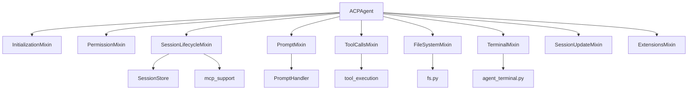
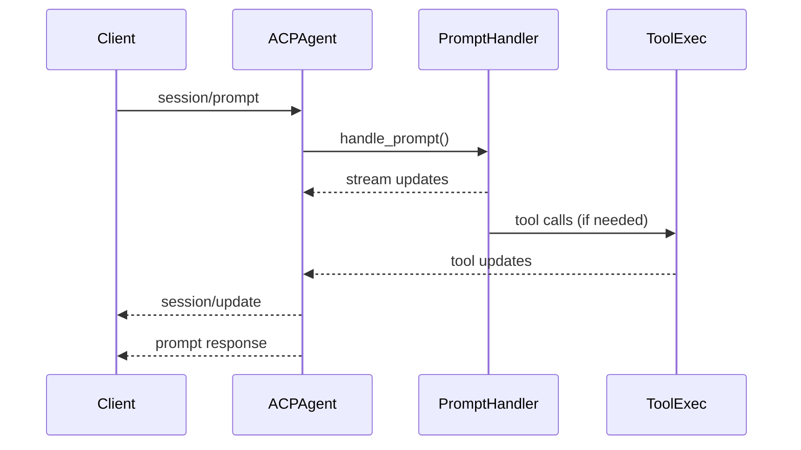

# Architecture

This document explains the high-level structure of the isaac codebase, with a
focus on the ACP agent and client staying independent while interoperating with
any ACP-compliant peer.

## Goals

- Keep agent and client code paths independent and protocol-compliant.
- Make responsibilities obvious by module and file name.
- Prefer small, focused modules over monoliths.

## Directory Map

- `src/isaac/agent/` ACP agent implementation and runtime services.
- `src/isaac/agent/acp/` ACP endpoint handlers split by domain.
- `src/isaac/agent/brain/` prompt handling, planning, and model wiring.
- `src/isaac/agent/tools/` tool registry, schema, execution, registration.
- `src/isaac/agent/subagents/` delegate agents exposed as tools.
- `src/isaac/client/` ACP client REPL example (no shared runtime with agent).

## ACP Agent Layout

The ACP agent composes mixins for each protocol area. This keeps ACP endpoints
isolated and testable while the public agent class remains small.

### ACP Handlers

- `src/isaac/agent/acp/initialization.py` init and auth.
- `src/isaac/agent/acp/permissions.py` permission requests and run_command gating.
- `src/isaac/agent/acp/sessions.py` session lifecycle and mode/model changes.
- `src/isaac/agent/acp/prompts.py` prompt turn handling.
- `src/isaac/agent/acp/tools.py` tool calls and dispatch.
- `src/isaac/agent/acp/filesystem.py` fs endpoints.
- `src/isaac/agent/acp/terminal.py` terminal endpoints.
- `src/isaac/agent/acp/updates.py` session update persistence and replay.
- `src/isaac/agent/acp/extensions.py` extMethods (model/list, model/set).

## Prompt Handling Flow

## Tools

Tools are split into registry, schema, execution, and registration to keep
protocol exposure and runtime execution independent and reusable.

- Registry/metadata: `src/isaac/agent/tools/registry.py`
- Schema generation: `src/isaac/agent/tools/schema.py`
- Execution/validation: `src/isaac/agent/tools/executor.py`
- Agent registration: `src/isaac/agent/tools/registration.py`

## Delegate Subagents

Delegate agents are tools with their own system prompts and tool allowlists.
They run in fresh contexts by default (no shared conversation history).

- Registry/execution: `src/isaac/agent/subagents/delegate_tools.py`
- Tool definitions: `src/isaac/agent/subagents/planner.py`,
  `src/isaac/agent/subagents/review.py`, `src/isaac/agent/subagents/coding.py`

## Client Independence

The client lives entirely under `src/isaac/client/` and uses ACP stdio transport
to connect to any compliant agent, not just isaac. The agent likewise does not
depend on any client-specific behaviors and only uses ACP-defined flows.
