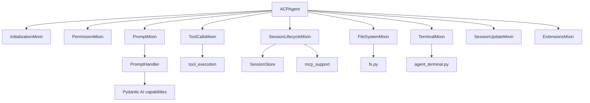
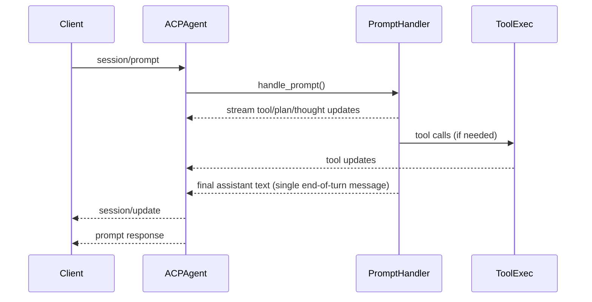

# Architecture

This document explains the high-level structure of the isaac codebase, with a
focus on the ACP agent and client staying independent while interoperating with
any ACP-compliant peer.

## Goals

- Keep agent and client code paths independent and protocol-compliant.
- Make responsibilities obvious by module and file name.
- Prefer small, focused modules over monoliths.

## Directory Map

- `src/isaac/agent/` ACP agent implementation and runtime services.
- `src/isaac/agent/acp/` ACP endpoint handlers split by domain.
- `src/isaac/agent/brain/` prompt handling, planning, and model wiring.
- `src/isaac/agent/capabilities.py` Isaac-specific Pydantic AI 2.x capabilities.
- `src/isaac/agent/tools/` tool registry, schema, execution, registration.
- `src/isaac/agent/subagents/` delegate agents exposed as tools.
- `src/isaac/client/` ACP client REPL example (no shared runtime with agent).

## ACP Agent Layout

The ACP agent composes mixins for each protocol area. This keeps ACP endpoints
isolated and testable while the public agent class remains small.

```mermaid
flowchart TD
  ACPAgent[ACPAgent] --> Init[InitializationMixin]
  ACPAgent --> Perm[PermissionMixin]
  ACPAgent --> Sess[SessionLifecycleMixin]
  ACPAgent --> Prompt[PromptMixin]
  ACPAgent --> Tools[ToolCallsMixin]
  ACPAgent --> FS[FileSystemMixin]
  ACPAgent --> Term[TerminalMixin]
  ACPAgent --> Updates[SessionUpdateMixin]
  ACPAgent --> Ext[ExtensionsMixin]

  Prompt --> Brain[PromptHandler]
  Brain --> Caps[Pydantic AI capabilities]
  Tools --> ToolExec[tool_execution]
  Sess --> Store[SessionStore]
  Sess --> MCP[mcp_support]
  FS --> FSHelpers[fs.py]
  Term --> TermHelpers[agent_terminal.py]
```

### ACP Handlers

- `src/isaac/agent/acp/initialization.py` init and auth.
- `src/isaac/agent/acp/permissions.py` permission requests and run_command gating.
- `src/isaac/agent/acp/sessions.py` session lifecycle and session config option changes (mode/model via `session/set_config_option`).
- `src/isaac/agent/acp/prompts.py` prompt turn handling.
- `src/isaac/agent/acp/tools.py` tool calls and dispatch.
- `src/isaac/agent/acp/filesystem.py` fs endpoints.
- `src/isaac/agent/acp/terminal.py` terminal endpoints.
- `src/isaac/agent/acp/updates.py` session update persistence and replay.
- `src/isaac/agent/acp/extensions.py` extension request/notification hooks (no model-selection ext methods).

## Pydantic AI 2.x Capability Boundary

Isaac-specific cross-cutting agent behavior should live in
`src/isaac/agent/capabilities.py` before adding more prompt-handler state.
Current capability assembly includes:

- `build_system_prompt_capability()`: wraps Pydantic AI `ReinjectSystemPrompt(replace_existing=True)` so Isaac's server-side prompt is reinserted on every provider request and stale system prompt parts from ACP/UI history cannot override it.
- `build_history_sanitizer_capability()`: wraps Pydantic AI `ProcessHistory` so empty provider-bound text parts are stripped without losing message metadata.
- `build_mode_capability()`: wraps Pydantic AI `PrepareTools` to map ACP session mode (`ask`/`yolo`) to tool visibility/approval semantics.
- `build_acp_permission_capability()`: wraps Pydantic AI `HandleDeferredToolCalls` to resolve deferred approval requests through ACP permission prompts during a run.
- `build_event_stream_observer_capability()`: wraps Pydantic AI `ProcessEventStream` so ACP tool-call progress, planner updates, tool-history summaries, and recent-file tracking observe each run at the Pydantic AI event-stream boundary instead of through `stream_with_runner` callbacks.
- `build_recent_files_capability()`: contributes transient Pydantic AI instructions for ambiguous file follow-ups based on files touched by mutating tools, without appending those hints to persisted chat history.
- `build_isaac_tools_capability()`: wraps Isaac's existing ACP-compatible coding tools in a Pydantic AI `Toolset` capability so normal agents get tools at construction time instead of via post-construction mutation.
- `build_optional_harness_capabilities()`: opt-in bridge for Harness experiments. FileSystem/Shell are prefixed as `harness_*` tools and CodeMode remains explicit opt-in.

ACP event projection is now attached as a per-run `ProcessEventStream`
capability. `stream_with_runner()` treats Pydantic AI `run_stream_events()` as
an async context manager, converts history into Pydantic AI message objects,
streams text/thinking/final outputs, and forwards per-run capabilities; it does
not own system prompt, recent-file context, approval, or tool/plan event policy.

Pydantic AI Harness is available through the optional `harness` extra for opt-in
experiments. CodeMode is intentionally disabled by default and can be enabled with
`ISAAC_HARNESS_CODE_MODE=1` once the approval/sandbox UX has been reviewed for
the target ACP client.

## Prompt Handling Flow

```mermaid
sequenceDiagram
  participant Client
  participant Agent as ACPAgent
  participant Prompt as PromptHandler
  participant Tools as ToolExec

  Client->>Agent: session/prompt
  Agent->>Prompt: handle_prompt()
  Prompt-->>Agent: stream tool/plan/thought updates
  Prompt->>Tools: tool calls (if needed)
  Tools-->>Agent: tool updates
  Prompt-->>Agent: final assistant text (single end-of-turn message)
  Agent-->>Client: session/update
  Agent-->>Client: prompt response
```

## Tools

Tools are split into registry, schema, execution, and capability/toolset assembly to keep
protocol exposure and runtime execution independent and reusable. Agents attach
Isaac tools through Pydantic AI capabilities or constructor `toolsets`; there is no
post-construction registration path.

- Registry/metadata: `src/isaac/agent/tools/registry.py`
- Schema generation: `src/isaac/agent/tools/schema.py`
- Execution/validation: `src/isaac/agent/tools/executor.py`
- Capability/toolset assembly: `src/isaac/agent/tools/registration.py`

## Delegate Subagents

Delegate agents are tools with their own system prompts and tool allowlists.
They run in fresh contexts by default (no shared conversation history).

- Registry/execution: `src/isaac/agent/subagents/delegate_tools.py`
- Tool definitions: `src/isaac/agent/subagents/planner.py`,
  `src/isaac/agent/subagents/review.py`, `src/isaac/agent/subagents/coding.py`

## Client Independence

The client lives entirely under `src/isaac/client/` and uses ACP stdio transport
to connect to any compliant agent, not just isaac. The agent likewise does not
depend on any client-specific behaviors and only uses ACP-defined flows.

The reference client now opportunistically feeds raw `SessionNotification`
objects into ACP SDK `SessionAccumulator` when that contrib helper is available.
The existing terminal renderer still handles updates directly, but the
accumulated snapshot gives future UI/status work a canonical ACP state source
without replacing the rendering path in one risky step.
